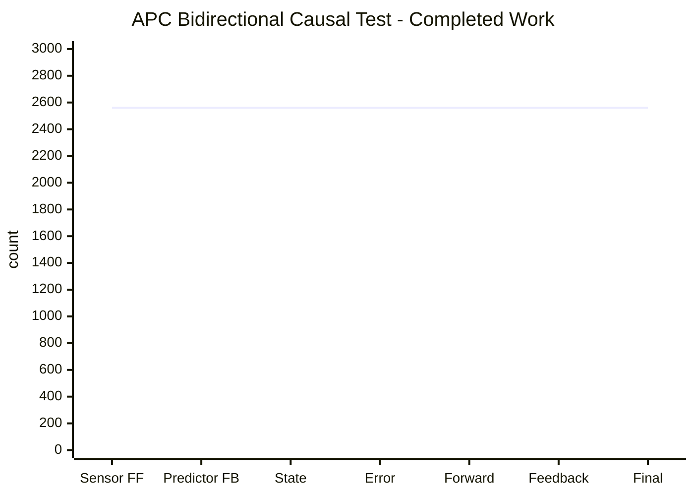
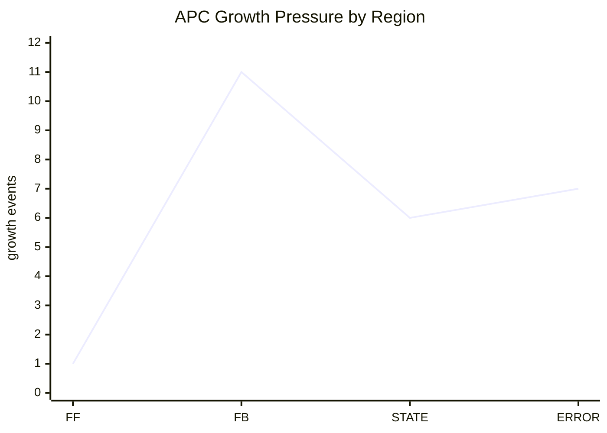

# AdaptivePackedCellContainer (APC)

`AdaptivePackedCellContainer` is an experimental C++ concurrency/data-structure project built around one central question:

> Can one 64-bit atomic cell act as both a value holder and a compute/event holder, while also carrying enough local metadata to describe its observer state, region, priority, timing, and authority?

APC tries to answer this by building a page-like container made of `std::atomic<uint64_t>` cells. A prefix of the array is used as a self-describing header. The remaining payload is divided into semantic regions such as feedforward messages, feedback messages, state, error, edge descriptors, weights, auxiliary storage, and free space.

The project is not a finished production library. It is a research/prototype runtime for testing **causal**, **segmented**, **bidirectional**, and **neuromorphic-inspired** data movement on ordinary C++ hardware that supports 64-bit atomic operations.

---

## Current Status

**Status:** experimental prototype  
**Language:** C++20-style code using atomics, threads, and packed integer metadata  
**Core storage unit:** `std::atomic<uint64_t>`  
**Main idea:** every cell carries both value and metadata  
**Current test result:** the end-to-end bidirectional causal test completes successfully, but exposes a header-vs-payload occupancy accounting bug.

From the current test output:

| Metric | Value |
|---|---:|
| Runtime | `48620 us` |
| Sensor FF produced | `2560` |
| Predictor FB produced | `2560` |
| State integrated | `2560` |
| Error computed | `2560` |
| Forward emitted | `2560` |
| Feedback emitted | `2560` |
| Final collected | `2560` |
| Terminal fail | `0` |
| Retry | `32` |
| Older FF observed | `1624` |
| Older FB observed | `1363` |

The important interpretation is:

- the dataflow completed;
- all final values were collected;
- there were no terminal failures;
- the exact payload scan ended clean;
- two nodes still had stale header accounting.

That means APC currently works as a test transport/runtime, but its metadata accounting is not yet fully authoritative.

---

## Output Line Graphs

The main pipeline counters are flat at `2560`, meaning every stage completed the same number of items.



Growth pressure was not evenly distributed. Feedback, state, and error paths required more growth than feedforward in this run.



The first 16 collected values show the expected output sequence:

```text
0  -> 2.5
1  -> 3.5
2  -> 4.5
3  -> 5.5
...
15 -> 17.5
```

---

## What APC Is

APC is best understood as a **self-describing concurrent page node**.

It is not only:

- a vector,
- a queue,
- a ring buffer,
- a graph node,
- a memory page,
- or a neural layer.

It combines parts of all of them.

A single APC instance contains:

1. a header made of packed atomic metadata cells;
2. a payload made of packed atomic data/event cells;
3. per-region layout bounds;
4. per-region occupancy summaries;
5. producer and consumer cursors;
6. local causal clocks;
7. branch/logical/shared identity;
8. graph-node semantics;
9. optional shared-chain growth;
10. manager/backoff/reclamation scaffolding.

The current design bias is explicit: APC tries to become a simulated-biological, heterogeneous, multidirectional, neuromorphic data structure that can hold values and also participate in compute.

---

## Core Design Model

### 1. PackedCell64

The smallest APC unit is a 64-bit packed cell.

Each cell is one atomic word:

```text
std::atomic<uint64_t>
```

The top 16 bits are metadata. The lower 48 bits are either:

- a 32-bit value plus a 16-bit clock, or
- a 48-bit clock/value field.

Conceptually:

```text
[ META16 ][ lower 48 bits ]
```

For `MODE_VALUE32`:

```text
[ META16 ][ CLK16 ][ VALUE32 ]
```

For `MODE_CLKVAL48`:

```text
[ META16 ][ CLOCK_OR_VALUE48 ]
```

The metadata contains:

| Field | Meaning |
|---|---|
| priority | scheduling or semantic urgency |
| node authority | who/what kind of node owns the meaning of the cell |
| locality | idle, published, claimed, faulty |
| mode | 32-bit value mode or 48-bit clock/value mode |
| region class | feedforward, feedback, state, error, etc. |
| relation offset | small offset/control meaning |
| data type | unsigned, int, float, char-like value category |

This is the most important idea in APC: a cell is not just data. It is a tiny protocol frame.

---

### 2. Cell Locality

A cell can be in one of these states:

| Locality | Meaning |
|---|---|
| `ST_IDLE` | free/available cell |
| `ST_PUBLISHED` | contains valid published data/event |
| `ST_CLAIMED` | temporarily owned by a thread during transition |
| `ST_EXCEPTION_BIT_FAULTY` | invalid/faulty cell |

The normal publish path is:

```text
IDLE -> CLAIMED -> PUBLISHED
```

The normal consume path is:

```text
PUBLISHED -> CLAIMED -> IDLE
```

The claim state is important because it prevents multiple threads from treating the same cell as free or consumable at the same time.

---

### 3. Timer and Causal Clocking

APC uses two clock scales:

| Clock | Location | Purpose |
|---|---|---|
| `CLK16` | inside `MODE_VALUE32` cells | compact causal freshness stamp |
| `CLK48` | inside `MODE_CLKVAL48` cells | larger local time/clock value |

Each APC segment has a `LOCAL_CLOCK48` metadata cell. Normal value cells carry only `CLK16`, which is cheaper and leaves room for a 32-bit value.

The intended model is:

- `CLK16` is a fast local freshness marker;
- `CLK48` is used to reconstruct or anchor local time;
- accepted/emitted clock metadata tracks feedforward and feedback progress.

Important limitation: `CLK16` can wrap. It is useful for recent local ordering, but it should not be treated as an absolute global timestamp without reconstruction and wrap handling.

---

### 4. SegmentIO

`SegmentIODefinition` is the header/control layer for an APC node.

It is responsible for:

- reading and writing metadata cells;
- initializing branch identity;
- initializing logical/shared identity;
- initializing node semantics;
- initializing default region layout;
- reading region bounds;
- setting region bounds;
- tracking region occupancy;
- setting/clearing ready bits;
- deciding whether a segment should split/grow;
- touching the local clock.

The header is part of the same backing array as the payload. This makes the node self-describing: the APC carries its own identity, layout, capacity, clocks, counters, and routing metadata.

---

### 5. Regions

The payload is physically divided into semantic regions.

Common regions are:

| Region | Purpose |
|---|---|
| `FEEDFORWARD_MESSAGE` | upward/forward events |
| `FEEDBACKWARD_MESSAGE` | downward/backward correction events |
| `STATE_SLOT` | local integrated state |
| `ERROR_SLOT` | mismatch/error/surprise events |
| `EDGE_DESCRIPTOR` | graph edge metadata |
| `WEIGHT_SLOT` | weight or transform parameters |
| `AUX_SLOT` | extra scratch/control storage |
| `FREE_SLOT` | unused payload capacity |

In the current output, the printed regions had these local spans:

| Region | Span | Size |
|---|---:|---:|
| FF | `[96,108)` | `12` |
| FB | `[108,117)` | `9` |
| STATE | `[117,129)` | `12` |
| ERROR | `[129,138)` | `9` |
| AUX | `[160,164)` | `4` |

The full payload capacity is `160` cells in a `256`-cell APC, because the first `96` cells are metadata/header cells.

---

### 6. AdaptivePackedCellContainer

`AdaptivePackedCellContainer` is the main active node.

It adds:

- owned memory allocation;
- producer slot reservation;
- thread-local producer block caching;
- local publish;
- local consume;
- traversal across shared segments;
- growth by adding shared segments;
- exact local and chain occupancy scans;
- ready-mask rebuild;
- manager registration.

Basic lifecycle:

```text
create manager
create APC node
attach manager
initialize node
publish cells by region
consume cells by region
inspect counters/invariants
free node
stop manager
```

Minimal conceptual usage:

```text
1. Create PackedCellContainerManager.
2. Create one or more APC nodes.
3. Attach each node to the manager.
4. Initialize each node with capacity and configuration.
5. Compose PackedCell64 values.
6. Publish cells into a region such as FEEDFORWARD_MESSAGE.
7. Consume cells from a region using a scan cursor.
8. Use exact counters to validate the final state.
9. Free all APC nodes before shutdown.
```

---

### 7. PackedCellContainerManager

The manager is the central runtime service.

It is responsible for:

- thread registration;
- manager thread startup/shutdown;
- global epoch tracking;
- wait slots;
- adaptive backoff access;
- APC registration;
- APC cleanup stack;
- APC work stack;
- branch lookup by branch id;
- background work processing.

Important limitation: the current manager has reclamation scaffolding, but full safe reclamation should still be treated as incomplete. Dynamically grown child segments need a stricter retire/grace-period/free protocol before this can be used as a long-running production allocator.

---

### 8. Adaptive Backoff

APC uses adaptive backoff to reduce waste during contention.

The idea is:

- if a CAS fails, do not immediately burn CPU forever;
- use observed timing/contention to decide whether to spin, yield, or sleep;
- integrate with the local clock so waiting can be related to causal time.

Backoff belongs in the runtime because APC is intended to support many producers and consumers. However, the current backoff should be considered a performance policy, not a proof of correctness.

---

## Decentralized and Central Occupancy

APC currently has two kinds of truth:

### Exact payload truth

This comes from scanning the actual payload cells and counting their locality states.

Example from current output:

```text
exact locality: idle=160 pub=0 claim=0 faulty=0 sum=160 invariant=OK
```

This is the most reliable debug truth because it looks directly at the cells.

### Header snapshot truth

This comes from header metadata counters such as:

- published count;
- claimed count;
- idle count;
- faulty count;
- per-region published pressure;
- ready bits.

Example from current output:

```text
header locality: idle=160 pub=1 claim=0 faulty=0 sum=161 invariant=BAD
```

This is faster to read, but the current run proves it can become stale or inconsistent.

### Current bug exposed by the output

For `Sensor` and `Predictor`, exact payload state is clean, but header counters still report one published cell:

```text
Sensor:    header pub=1, exact pub=0
Predictor: header pub=1, exact pub=0
```

This means the payload is empty, but the header still believes there is published pressure.

This is currently the most important correctness issue in APC.

Recommended interpretation:

- use exact payload scan as authoritative during testing;
- treat header counters and ready bits as fast summaries;
- repair/rebuild header metadata after stress tests;
- do not allow split/reclaim/sleep decisions to depend only on stale header counters.

---

## Invariants

These invariants should hold for a healthy APC segment.

### Capacity invariant

```text
total_capacity = metadata_cells + payload_capacity
```

In the current output:

```text
256 = 96 + 160
```

### Exact locality invariant

```text
exact_idle + exact_published + exact_claimed + exact_faulty == payload_capacity
```

This holds in the current output for all printed nodes.

### Header locality invariant

```text
header_idle + header_published + header_claimed + header_faulty == payload_capacity
```

This fails for `Sensor` and `Predictor` in the current output:

```text
160 + 1 + 0 + 0 = 161, but payload_capacity = 160
```

### Region pressure invariant

For a region with span `N`:

```text
0 <= region_published_count <= N
```

The current stale pressure values are small but still semantically wrong because exact payload says those regions are empty.

### Ready-bit invariant

If a region has no exact published payload cells, its ready bit should eventually be clear.

Current output shows stale ready bits:

```text
Sensor ready_bit=0x2 with FF meta_pub=1 but exact FF is empty
Predictor ready_bit=0x4 with FB meta_pub=1 but exact FB is empty
```

This suggests ready-bit clearing and occupancy update need a stronger synchronization rule.

---

## How the Current Test Works

The current test uses five conceptual nodes:

| Node | Role |
|---|---|
| Sensor | produces feedforward values |
| Predictor | produces feedback/correction values |
| Comparator | compares/passes forward stream and computes error |
| Integrator | integrates state/error information |
| Motor | collects final outputs |

The test reports:

- `Sensor FF produced = 2560`
- `Predictor FB produced = 2560`
- `State integrated = 2560`
- `Error computed = 2560`
- `Final collected = 2560`

This means the test workload completed without losing final outputs.

The test also reports older observed cells:

```text
Older FF observed = 1624
Older FB observed = 1363
```

This means consumers saw many cells that were not causally newer than the last accepted clock for that stream. That is not automatically fatal, but it shows that causal filtering is active and that clock ordering/contention should be studied further.

---

## What Is Novel Here

APC is novel mostly in its combination of ideas, not because every individual piece is new.

The distinctive parts are:

1. **Every cell is self-describing.**  
   A cell carries value, locality, region, authority, priority, type, and time metadata.

2. **The container is self-describing.**  
   The header lives in the same atomic array as the payload.

3. **Regions are semantic, not just memory ranges.**  
   FF, FB, STATE, ERROR, EDGE, WEIGHT, AUX, and FREE have computational meaning.

4. **Causality is compressed into the cell.**  
   `CLK16` gives cheap local ordering while `CLK48` anchors local time.

5. **The node can grow as a shared chain.**  
   Instead of only resizing or reallocating, APC can attach additional shared segments.

6. **The architecture is aimed at bidirectional compute.**  
   It is designed for feedforward plus feedback paths, not only one-way queues.

7. **It is portable in principle.**  
   The core assumption is C++ plus 64-bit atomic operations, not a vendor-specific GPU API.

---

## Current Limitations and Bugs

| Area | Current issue | Practical meaning |
|---|---|---|
| Header occupancy | header counters can disagree with exact payload scan | fast metadata is not fully authoritative yet |
| Ready bits | ready bit can remain set after exact payload is empty | scheduler may think work exists when it does not |
| Region search | publish/consume still rely on probing/scanning | complexity can become high as regions grow |
| Region index | bitmaps are rebuilt but not fully used as the main publish/consume path | acceleration path is incomplete |
| Reclamation | manager has epoch/cleanup scaffolding but full safe reclamation is incomplete | long-running growth may leak or require manual cleanup discipline |
| Shared-chain lookup | branch lookup and chain traversal are linear | many segments can become expensive |
| Layout mutation | begin/end region bounds are written separately | readers can observe partial layout changes unless guarded carefully |
| Clock16 | compact clock can wrap | old/stale comparisons need careful reconstruction rules |
| Naming | several identifiers contain typos | readability and public API polish need work |
| Bidirectional compute | current test is bidirectional dataflow, not yet true atomic spike-level bidirectional compute | computation semantics need formalization |

---

## Recommended Fix Priority

### 1. Make occupancy truthful

The first fix should be the header-vs-exact occupancy bug.

Recommended rule:

> The physical cell is the truth. Header counters are summaries. If summaries disagree with cells, rebuild summaries from cells.

A robust implementation should either:

- update cell, occupancy, and ready-bit state through one authoritative transition path; or
- mark summaries dirty and repair them through an exact rebuild pass.

### 2. Make ready-bit clearing safe

Setting a ready bit is usually safe when publishing. Clearing a ready bit is dangerous because another thread may publish at the same time.

Safer rule:

> Fast paths may set ready bits. Only an exact or versioned check should clear them.

### 3. Replace linear search with bitmaps

Use region/class bitmaps as the main candidate discovery structure.

Desired model:

```text
bitmap says candidate exists -> inspect candidate cell -> CAS cell -> update bitmap/counters
```

The packed cell remains authoritative. The bitmap only makes finding candidates fast.

### 4. Complete reclamation

Before APC is used as a long-running runtime, child segment lifetime must be controlled by a real retire/grace-period/free protocol.

### 5. Formalize bidirectional compute

A true multidirectional APC should define one “spike/event” as a causal unit that can update:

- feedforward output;
- feedback output;
- local state;
- error state;
- possibly lateral output.

Those related cells should share a causal stamp so the system can treat them as one logical compute event.

---

## Beginner Usage Guide

### When to use APC

Use APC when you want to experiment with:

- atomic cell protocols;
- concurrent publish/consume regions;
- causal clocks;
- bidirectional message flow;
- self-describing page-like nodes;
- graph-like compute nodes;
- neuromorphic-inspired state/error/message regions.

Do not use APC yet as:

- a production queue;
- a safe allocator;
- a replacement for a proven lock-free container;
- a production neural-network runtime;
- a GPU/VRAM runtime without further work.

### Basic mental model

Think of one APC as a small computational page:

```text
[ header metadata ][ FF ][ FB ][ STATE ][ ERROR ][ EDGE ][ WEIGHT ][ AUX ][ FREE ]
```

A producer publishes packed cells into one region.

A consumer claims published cells from one region, reads them, and returns the slot to idle.

The header records summaries, clocks, identities, and region layout.

### How to inspect a run

After running a test, check these first:

1. `Terminal fail` should be `0`.
2. Produced and consumed/final counts should match expected workload.
3. Exact locality invariant should be `OK`.
4. Header locality invariant should also be `OK`; if not, metadata accounting needs repair.
5. Ready bits should match exact published region pressure.
6. Growth counters should be reasonable for the region sizes.
7. Older observed counts should be tracked because high numbers may indicate causal ordering pressure or clock ambiguity.

---

## Reading the Current Output

### Successful parts

The system successfully moved `2560` units through every major stage:

```text
Sensor FF produced    = 2560
Predictor FB produced = 2560
State integrated      = 2560
Error computed        = 2560
Final collected       = 2560
```

The final values are ordered and readable:

```text
0 -> 2.5
1 -> 3.5
2 -> 4.5
...
```

This means the basic test pipeline works.

### Exposed defect

The header still reports one published cell in `Sensor` and `Predictor`, but exact payload scan reports zero published cells.

This is the key defect to fix before claiming strict authoritative occupancy.

### Growth pressure

Growth occurred mostly in feedback, state, and error paths:

```text
Grow FF    = 1
Grow FB    = 11
Grow STATE = 6
Grow ERROR = 7
```

This suggests the bidirectional/error side is more pressure-heavy than the feedforward side for the current test.

---

## Design Bias

The design bias of APC is intentional:

> A cell should know more about itself than a normal value knows.

A normal value only stores data. An APC cell stores data plus context:

- where it belongs;
- whether it is idle/published/claimed/faulty;
- how urgent it is;
- what kind of node owns it;
- when it was produced or touched;
- what kind of value it carries.

The larger bias is that a data structure can also behave like a compute substrate. APC is trying to make memory, message passing, state, and computation meet inside the same atomic page model.

This is ambitious. The cost is complexity. The benefit is that every operation can eventually become explainable in terms of:

```text
priority + causality + region class + node authority
```

That explainability goal is one of the strongest reasons to continue the project.

---

## Roadmap

### Short term

- Fix stale header occupancy.
- Fix stale ready bits.
- Add exact rebuild after stress tests.
- Make invariant failures loud.
- Clean public names and spelling.
- Document every metadata cell.

### Medium term

- Use bitmaps for publish/consume candidate search.
- Add O(1) branch id lookup.
- Add safer shared-chain growth protocol.
- Make layout mutation versioned.
- Make region pressure and ready bits consistent.
- Add stronger causal-clock diagnostics.

### Long term

- Complete safe reclamation.
- Implement spike-level bidirectional compute semantics.
- Add portable SIMD for exact scans and bitmap rebuilds.
- Add SYCL or another portable heterogeneous layer for batch region compute.
- Separate stable APC core from experimental coordinator/test harness.

---

## Final Honest Summary

APC is not a finished container. It is not garbage either.

It is a serious experimental attempt to build a self-describing, causally stamped, region-segmented, atomic compute/data node. The current output proves that the dataflow test can complete successfully, but it also proves that metadata accounting is still imperfect.

The next important step is not adding more features. The next important step is making the invariants impossible to lie.

Once exact payload state, header summaries, ready bits, growth decisions, and reclamation agree with each other, APC can become a much stronger foundation for multidirectional neuromorphic-style computation.
